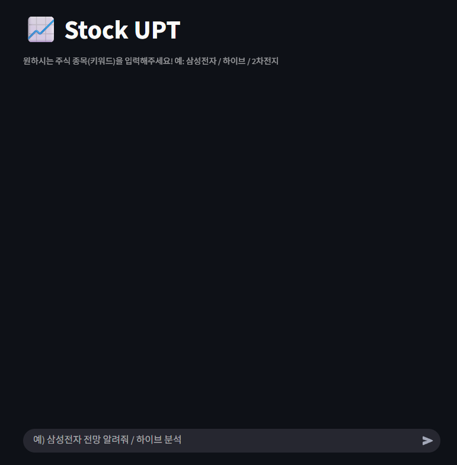
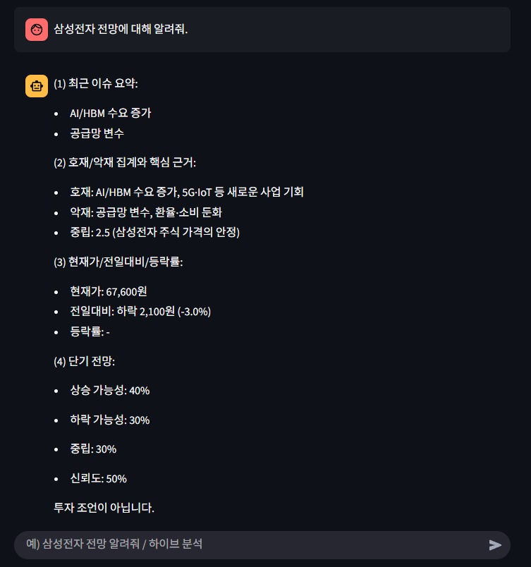
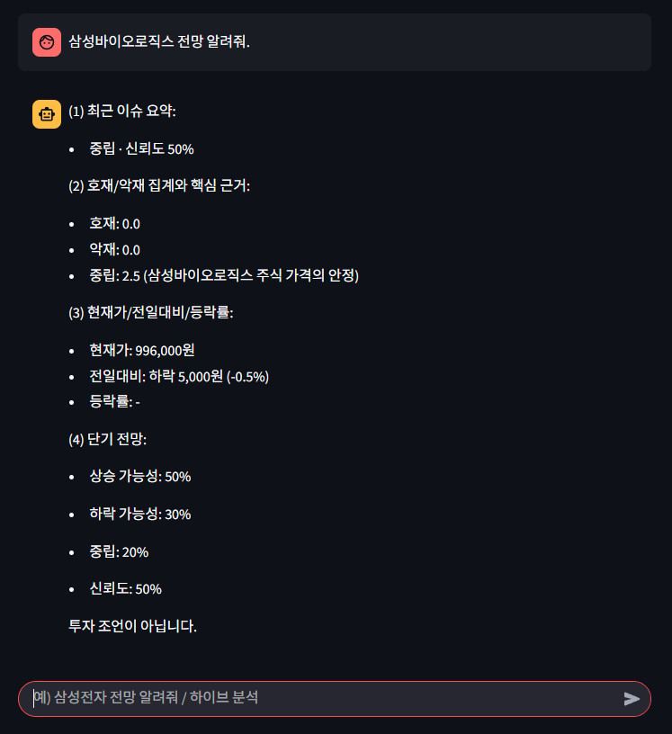

# stock-upt-main
# My Stock Analysis - UPT Chatbot Toy Project

## My Stock Chatbot (Stock UPT) Streamlit Project




## Overview

This repository contains a project that builds an Augmented Search Generation (RAG) application leveraging LangChain and Streamlit. The primary goal of this application is to provide insights and answers based on Korean Stock Market Data (KOSPI & KOSDAQ). Advanced natural language processing (NLP) techniques are used to improve responses by combining chat transcripts with low-shot learning templates.

## Features

- **LangChain Integration**: Utilizes LangChain to manage and interact with language models effectively.
- **Streamlit Interface**: A user-friendly web interface created with Streamlit for seamless interaction.
- **Retrieval Augmented Generation (RAG)**: Combines retrieval-based techniques with generative models to produce accurate and context-aware answers.
- **Knowledge Base**: Focuses on the Korean Stock Market Data (KOSPI & KOSDAQ) as the primary knowledge base.
- **Chat History**: Maintains a history of user interactions to provide contextually relevant answers.
- **Few-Shot Learning Templates**: Enhances the model's responses by using predefined templates for better accuracy and consistency.

## Installation

1. Clone the repository:
    ```sh
    git clone https://github.com/usxxng/stock-upt.git
    cd stock-upt
    ```

2. Create and activate a virtual environment:
    ```sh
    python3 -m venv venv
    source venv/bin/activate (for Unix/Linux)
    .\venv\Scripts\activate.ps1 (for PowerShell)
    ```

3. Install the required dependencies:
    ```sh
    pip install -r requirements.txt
    ```

## Usage

1. Run the Streamlit application:
    ```sh
    streamlit run chat.py
    ```

2. Open your web browser and navigate to the displayed local URL to interact with the application.

## Project Structure

- `chat.py`: Main application script that runs the Streamlit interface.
- `llm.py`: Contains utility functions for handling the knowledge base and model interactions.
- `config.py`: File with few-shot learning templates used to generate answers.

## How It Works

1. **Data Retrieval**: The application retrieves relevant sections of the South Korean Income Tax Law based on user queries.
2. **Contextual Processing**: Utilizes chat history to maintain context across multiple interactions.
3. **Template-Based Generation**: Applies few-shot learning templates to enhance the accuracy and relevance of the generated answers.
4. **User Interface**: Provides an intuitive web interface through Streamlit for users to interact with the application seamlessly.

## Contributing

Contributions are welcome! Please feel free to submit a Pull Request or open an Issue to discuss improvements, bug fixes, or new features.

## Acknowledgments

- [LangChain](https://langchain.com/)
- [Streamlit](https://streamlit.io/)
- All contributors and users of the project.

---
